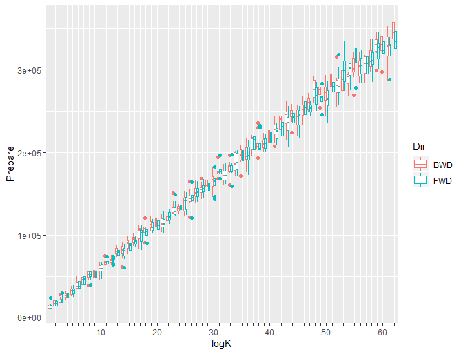
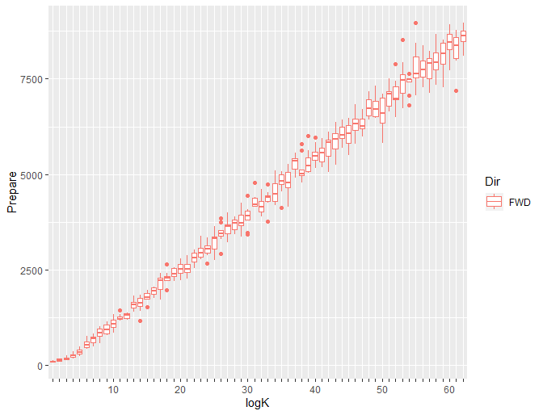
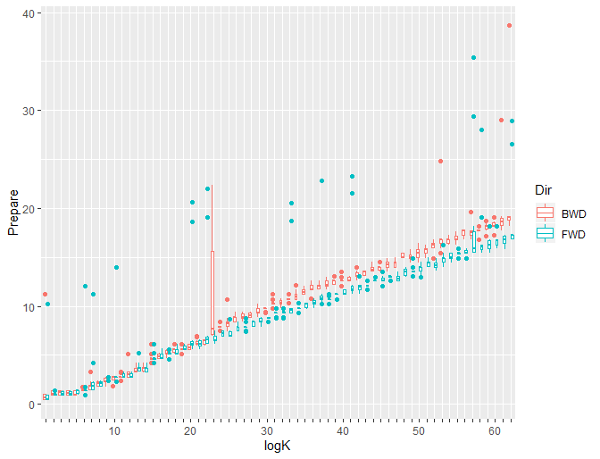
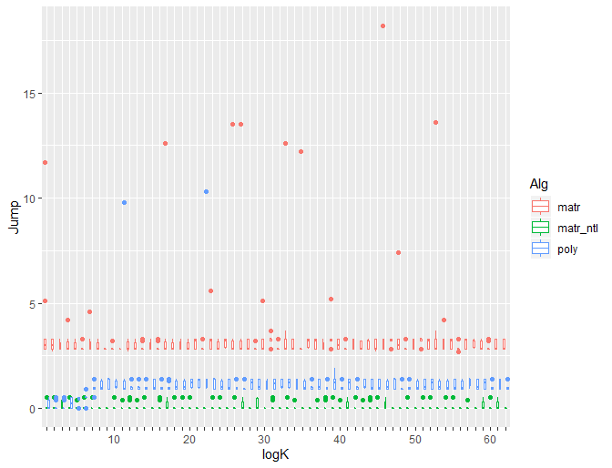
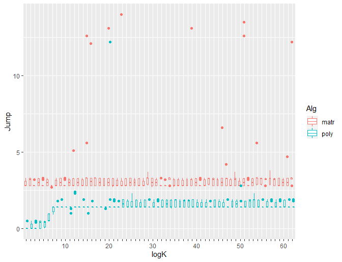

# {{page.title}}

{{page.description}}

Published: 2026-06-07.

Originally published: [CodeProject](https://web.archive.org/web/20250507172405/https://www.codeproject.com/Articles/5265915/XorShift-Jump-101-Part-2-Polynomial-Arithmetic), 2020-04-20.

\[[Source Code](https://github.com/sergeykorop/xorshift-jump/)\]

## Introduction

This is the second part of my tutorial dedicated to the jumping
procedures for the xorshift family of random number generators. The
[first part](../matrix-multiplication/) gave a motivation for this article
and considered an algorithm based on matrix multiplication. This time
we will learn about another one using polynomials. Finally, we will
analyze the theoretical and empirical performance of these two
algorithms.

Note these two parts of the article share the same numbering of
equations and references as well as the source code examples.

## Background

_This section is exactly reproduced from the part 1 for the readers' convenience._

It is assumed that the reader is familiar with linear RNG theory
basics explained in
[`System.Random` and Infinite Monkey Theorem](/monkey_typewriter/).
Unlike that article, the demo code for this one is written in C++ 11
so the reader should be fluent in this dialect at the intermediate
level.

Polynomial-based approach requires some additional knowledge in the
basics of algebra, such as the notion of polynomial, its properties
and operations involving polynomials. Software implementation is based
on [NTL](http://www.shoup.net/ntl/), a library of number theory
methods developed by Victor Shoup. This library, in turn, needs
[GNU GMP](http://gmplib.org/) and
[GF2X](http://gforge.inria.fr/projects/gf2x/). Versions used for this
article are NTL 11.0.0, GMP 6.1.2, and GF2X 1.2, respectively.

While NTL documentation mentions that it is possible to build this
library with Visual C++, the recommended environment should be
Unix-style, such as G++ (with accompanying toolchain) under Linux or
Cygwin (I used this one).

Some C++ code for this article has been generated automatically by a
program written in Haskell. Source code archive includes ready-to-use
output of this generator so the reader doesn't necessarily have to run
it. Otherwise, some working Haskell system, e.g.,
[Haskell Platform](https://www.haskell.org/platform/windows.html),
would be needed. Readers not familiar with Haskell would also need some
beginner-level guide. I used
[Yet Another Haskell Tutorial](http://users.umiacs.umd.edu/~hal/docs/daume02yaht.pdf)
by Hal Daumé III.

[Google Test](https://github.com/google/googletest) 1.8.1 is used for unit testing infrastructure.

## Polynomial Arithmetic-based Approach

Matrix-based jump described in Part 1 has significant drawback: the
lack of efficiency. Indeed, matrix multiplication operations become
quite expensive if you have large matrices: $O(N^3)$ for naive
implementation and the lower boundary $\Omega(N^2)$ for the best
implementation possible.

More efficient jump procedure based on polynomial arithmetic has been described in \[[2](#ref.2)\].

In this section we will begin from theory beyond this algorithm and
continue with implementation details of forward and backward
jumps. Since these algorithms are almost identical, it seems be a good
idea to describe them both in parallel rather than separately.

### Theoretical Background

Let's begin from the definition of the
[characteristic polynomial](https://en.wikipedia.org/wiki/Characteristic_polynomial).
Given matrix $A$, polynomial

$$
p(z) = \det(zI + A) = z^N + \alpha_1 z^{N-1} + \cdots + \alpha_{N-1} z + \alpha_N
$$

is known as _characteristic polynomial_ of this matrix. (Note that
[definition](https://en.wikipedia.org/wiki/Characteristic_polynomial#Formal_definition)
from Wikipedia uses another expression, $\det(zI - A)$, but in
$\mathbb{F}_2$ addition and subtraction are the same.) Fundamental
property of this polynomial is

$$
p(A) = A^N + \alpha_1 A^{N-1} + \cdots + \alpha_{N-1} A + \alpha_N I = 0.
$$

Polynomial arithmetic defines a notion of taking one polynomial modulo another one:

$$
g(z) = f(z) \bmod h(z),\quad \text{if } f(z) = q(z)h(z) + g(z).
$$

We will consider a particular case of

$$
g(z) = z^k \bmod p(z) = \alpha_1 z^{N-1} + \cdots + \alpha_{N-1} z + \alpha_N
$$

which can be calculated with logarithmic complexity with respect to $k$.

Using relation above, we can conclude that

$$
g(z) = z^k + q(z)p(z),
$$

and, if we substitute $A$ as an argument and rearrange terms,

$$
A^k = g(A) + q(A)p(A).
$$

Finally, since $p(A) = 0$,

$$
A^k = g(A).
$$

Let's use this equivalence to calculate our jump transform $T^kX$:

$$
T^kX = (\alpha_1 T^{N-1} + \cdots + \alpha_{N-1} T + \alpha_N I)X.
$$

This can also be written using [Horner's method](https://en.wikipedia.org/wiki/Horner%27s_method) as

$$
\label{eq:horner} T^kX = T(\cdots T(T(T\alpha_1 X + \alpha_2 X) + \alpha_3 X) + \cdots + \alpha_{N-1}X) + \alpha_N X. \tag{2}
$$

Note the structure of this formula: first of all, we take state vector
$X$, calculate $\alpha_1 X$ and multiply it by $T$. Then we add our
state vector multiplied by $\alpha_2$ one more time getting new state
vector which is in turn transformed by multiplying it by $T$ again,
and so on. Now, what does it mean that some state vector is multiplied
by $T$? Yes, it means that we take xorshift RNG in some state and do
one step forward. And we already know simple algorithm to do that step
fast, `step_forward()`.

<a id="perf_estimate"></a>Would this algorithm be better than matrix-based one?
First of all, it is an evident winner by memory consumption: our
&ldquo;transition polynomial&rdquo; can be stored in $N$ bits of
memory while transition matrix takes $N\times N$ bits. This is
especially important for RNGs with large state vectors, such as
[Mersenne Twister](https://en.wikipedia.org/wiki/Mersenne_Twister)
where state vector consists from 624 32-bit words. In this
case, transition matrix would take $(624*32)^2=398721024$ bits (about
47 megabytes) of memory! In our case of 128-bit xorshift the gain
wouldn't be so significant but also noticeable ($128/8=16$ bytes
versus $128^2/8=2048$ bytes).

Regarding calculation speed, if we have already prepared transition
matrix or polynomial, asymptotic complexity is the same. Indeed,
matrix to vector multiplication requires xoring together $N$ bit
matrix row with state vector of the same length and this operation is
repeated for each bit of the output giving us the resulting complexity
$O(N^2)$. For polynomial-based transition we do single step of RNG
algorithm and state vector addition ($O(N)$) for each non-zero
coefficient ($N$ in the worst case). So, we will also have total
complexity $O(N^2)$ but these estimations hide constant factors which
could make them significantly different in our particular case. We
will make an experiment to see what happens.

One more improvement to this algorithm is mentioned in
\[[1](#ref.1)\]. Is characteristic polynomial of matrix $A$ the only
one who have a property of $p(A)=0$? The answer is &ldquo;no&rdquo;.
There is a whole class of _nullifying polynomials_ which can have a
variety of degrees, and one with minimal degree is called
[minimal polynomial](https://en.wikipedia.org/wiki/Minimal_polynomial_(linear_algebra)).
If we use minimal polynomial instead of characteristic, we can expect
that it's degree can be less than $N$ so even in the worst case we
will perform less operations to calculate new RNG state.

### Forward Jump

Code discussed in this section and below is based on
[_jump_ahead.tar.gz_](http://www.math.sci.hiroshima-u.ac.jp/~m-mat/MT/JUMP/jump_ahead.tar.gz),
reference implementation of jump algorithm for Mersenne Twister from
its authors. Note that currently there are
[newer versions](http://www.math.sci.hiroshima-u.ac.jp/~m-mat/MT/JUMP/index.html)
of this code, but my implementation used exactly that one.

For beginning, let's calculate minimal polynomial. To do that we will
use a `MinPolySeq` function from the NTL library. This function takes
a sequence of values produced by linear transformation (e.g. xorshift)
and an upper boundary of minimal polynomial to be calculated. We know
that minimal polynomial degree can't be greater than degree of
characteristic polynomial, i.e. `STATE_SIZE_EXP` in our case. The
sequence length must be at least twice longer than that boundary.

This code is implemented as function `init_transition_polynomials`.
We must call it explicitly before the first use of polynomial-based
transition algorithms. This approach is good enough in research but
for production use we should better precalculate the needed polynomial
and hardcode its coefficients in a source code as a static array of
bytes which can be used to initialize the modulo polynomial on demand.

Other steps to perform transition are taking $x^k$ modulo minimal
polynomial and applying it to given RNG state. The code for these
functions is very similar for forward and backward jumps so it will be
considered once after the next section where we will learn about
implementation details of backward jump.

### Backward Jump

One possible way to implement jumping backward would be using the
wrap-around property of the xorshift algorithm, that is, representing
$k$ steps backward as $P-k = 2^N-(k+1)$ steps forward, where $P=2^N-1$
is a period length for the xorshift with state size $N$. I'm going to
use another way and calculate the needed primitives for the reverse
sequence. In other words, I'm going to create another RNG algorithm
producing the same numbers as xorshift but in reverse direction.

First of all, let's calculate minimal polynomial. We can do this
without any knowledge of reverse xorshift. Just let's take the
sequence produced with xorshift but reverse it before passing to the
`MinPolySeq`.

Next step would be more tricky. Applying polynomial to initial state
($\ref{eq:horner}$) requires single step of the RNG, in our case,
stepping xorshift backward. Can we derive this formula from xorshift
definition?

For beginning, let's recall the definition of xorshift128:

```cpp
  uint32_t t = x ^ (x << 11);

  x = y; y = z; z = w;
  w = w ^ (w >> 19) ^ (t ^ (t >> 8));
```

where `x`, ..., `w` represent different 32-bit chunks of the 128-bit
state. We can see, that components `x`, `y`, and `z` of the updated
state are equal to `y`, `z`, and `w` of the initial state. So,
restoring those three components of the initial state is trivial.

To restore `x`, let's use properties of the xor operation:

$$
\begin{align*}
  x \oplus 0 &= x, \\
  x \oplus y \oplus x &= y.
\end{align*}
$$

As you can see from the code above, new value of `w` component is
calculated using its previous value (`w ^ (w >> 19)`, let's call it
`w`-subexpression for short) and value of some intermediate expression
(`t ^ (t >> 8)`, the `t`-subexpression, respectively) which, in turn,
is calculated from `x`.

Our first step would be recovering the value of `t`-subexpression. To
do that, we can use the `z`-component of the updated state. Indeed,
this `z` gets its value right from the past `w`. Therefore, if we
calculate `z ^ (z >> 19)` it would be equal to `w ^ (w >> 19)`
calculated from the past state and if we xor it with the new value of
`w`, we will &ldquo;peel off&rdquo; the `w`-subexpression and get pure value of
the `t`-subexpression:

```cpp
  uint32_t tt = w ^ (z ^ z >> 19); // (t ^ (t >> 8))
```

Note that this `tt` is not a `t` itself but an expression over
`t`. Can we recover `t`?

Let's consider some simpler example with shorter bit vector to catch
the basic idea. Let's have 8-bit quantity

$$
v = \left\langle v_7, v_6, v_5, v_4, v_3, v_2, v_1, v_0\right\rangle.
$$

Shifting this vector three bits to the right, for example, means
following:

$$
v \gg 3 = \left\langle 0, 0, 0, v_7, v_6, v_5, v_4, v_3\right\rangle.
$$

And xoring these values together would be

$$
v \oplus (v \gg 3) = \left\langle v_7, v_6, v_5, v_4 \oplus v_7, v_3 \oplus v_6, v_2 \oplus v_5, v_1 \oplus v_4, v_0 \oplus v_3\right\rangle.
$$

Note that the three most significant bits retained their original
values and we can extract them from bit vector and shift right three
bits:

$$
\left\langle 0, 0, 0, v_7, v_6, v_5, 0, 0 \right\rangle.
$$

If we xor this bit vector with $v \oplus (v \gg 3)$ we will get

$$
\left\langle v_7 \oplus 0, v_6 \oplus 0, v_5 \oplus 0, (v_4 \oplus v_7) \oplus v_7, (v_3 \oplus v_6) \oplus v_6, (v_2 \oplus v_5) \oplus v_5, v_1 \oplus v_4 \oplus 0, v_0 \oplus v_3 \oplus 0\right\rangle,
$$

which can be simplified to

$$
\left\langle v_7, v_6, v_5, v_4, v_3, v_2, v_1 \oplus v_4, v_0 \oplus v_3\right\rangle.
$$

That's it! Using the result of the transformation, we could extract
some bits of the argument and then recover more bits of this
argument. Doing the same with the recently recovered bits ($v_4$ and
$v_3$) we can go further and calculate the remaining two bits of $v$.

We can use this approach to recover the value of `t`:

```cpp
  uint32_t t_3 = tt & 0xFF000000U;
  uint32_t t_2 = (tt & 0x00FF0000U) ^ (t_3 >> 8);
  uint32_t t_1 = (tt & 0x0000FF00U) ^ (t_2 >> 8);
  uint32_t t_0 = (tt & 0x000000FFU) ^ (t_1 >> 8);

  uint32_t t = t_3 | t_2 | t_1 | t_0; // x ^ (x << 11)
```

And, finally, the value of `x`:

```cpp
  uint32_t x_10_00 = t & 0x000007FFU;
  uint32_t x_21_11 = (t & 0x003FF800U) ^ (x_10_00 << 11);
  uint32_t x_31_22 = (t & 0xFFC00000U) ^ (x_21_11 << 11);

  // ...
  x = x_31_22 | x_21_11 | x_10_00;
```

Now we are ready to implement jump procedure for both directions.

### Common Implementation

Let's start from initialization code which must be called before any
other jump functions:

```cpp
NTL::GF2XModulus fwd_step_mod;
NTL::GF2XModulus bwd_step_mod;

void init_transition_polynomials()
{
  state_t s;

  init(s);

  const size_t N = 2*STATE_SIZE_EXP;

  NTL::vec_GF2 vf(NTL::INIT_SIZE, N);
  NTL::vec_GF2 vb(NTL::INIT_SIZE, N);

  for(long i = 0; i < N; i++)
  {
    step_forward(s);

    vf[i] = vb[N - 1 - i] = s[3] & 0x01ul;
  }

  NTL::GF2X fwd_step_poly;
  NTL::GF2X bwd_step_poly;

  NTL::MinPolySeq(fwd_step_poly, vf, STATE_SIZE_EXP);
  NTL::MinPolySeq(bwd_step_poly, vb, STATE_SIZE_EXP);

  NTL::build(fwd_step_mod, fwd_step_poly);
  NTL::build(bwd_step_mod, bwd_step_poly);
}
```

This function is definitely the most mysterious part of the
polynomial-based jump implementation. For beginning, it creates an
instance of the xorshift RNG and generates a random sequence twice as
long as `STATE_SIZE_EXP`, the number of bits in the RNG state. The
least significant bit of the each number of this sequence is stored in
two vectors, `vf` and `vb` which are filled item by item but in
different orders.

These sequences are then passed to the NTL function `MinPolySeq` which
calculates minimal polynomials corresponding to the linear
transformations specified by our RNG and its counterpart producing the
same numbers in reverse direction. This NTL function is true magic:
looking at the values of the single bit from the RNG output, it can
extract the information about the whole RNG which is enough to
construct its minimal polynomial.

Finally, this function initializes two global objects, `fwd_step_mod`
and `bwd_step_mod`. This is an optimization provided by NTL. If you
need to raise different polynomials to different powers modulo the
same polynomial many times, it could be more efficient to preprocess
modulo polynomial, save the result and then re-use it again and again.

```cpp
void prepare_transition(tr_poly_t &tr_k, uint64_t k, Direction dir)
{
  tr_k.dir = dir;

  NTL::GF2X x(1, 1);

  switch(dir)
  {
    case Direction::FWD:
      NTL::PowerMod(tr_k.poly, x, k, fwd_step_mod);
      break;

    case Direction::BWD:
      NTL::PowerMod(tr_k.poly, x, k, bwd_step_mod);
      break;
  }
}

void add_state(state_t &x, const state_t &y)
{
  for(size_t i = 0; i < x.size(); i++)
    x[i] = x[i] ^ y[i];
}

void horner(state_t &s, const tr_poly_t &tr)
{
  state_t tmp_state = s;

  tmp_state.fill(0);

  int i = NTL::deg(tr.poly);

  if(i > 0)
  {
    for( ; i > 0; i--)
    {
      if(NTL::coeff(tr.poly, i) != 0)
        add_state(tmp_state, s);

      if(tr.dir == Direction::FWD)
        step_forward(tmp_state);
      else
        step_backward(tmp_state);
    }

    if(NTL::coeff(tr.poly, 0) != 0)
      add_state(tmp_state, s);
  }

  s = tmp_state;
}

void do_transition(state_t &s, const tr_poly_t &tr)
{
  horner(s, tr);
}
```

These functions are self-explanatory: `prepare_transition` simply
fills `tr_k` with $x^k \bmod f(x)$ where $f(x)$ is either
`fwd_step_mod` or `bwd_step_mod` depending from `dir`. The last one,
`do_transition`, applies polynomial `tr` to the RNG state `s`
implementing Horners' method. In this case, `dir` parameter determines
which single RNG step, forward or backward, should be performed.

### Performance comparison

I have already provided some
[theoretical considerations](#perf_estimate)
regarding performance of these two methods. Regadring memory
complexity, there is nothing to add and we can only repeat that
polynomial-based approach is the clear winner. So, our analysis below
will be focused on time complexity only.

Our previous estimates were related to $N$, the size of the RNG
state. They could be useful if you compare the same jumping algorithm
for different RNGs, but use them with care: big $O$ estmates are
asymptotical and may not work well for limited $N$ values
corresponding to state sizes. In our case, we apply two methods to the
same RNG, so $N$ is the same. Can we, therefore, conclude that our
jumping algorithms have constant complexity? No, we haven't yet able,
of course, since we have one more parameter to consider: the jump size
$k$.

Note that our jump algorithms have two separate phases, preparation
and transition. Their complexity may depend from parameters
differently.

For matrix-based method, adding $k$ to the estimation is simpler: this
parameter determines the complexity of preparation phase because we
raise matrix to the power $k$. Given constant $N$, power is calculated
in $O(\log k)$ steps. Transition phase is even better: it involves
singe matrix-to-vector multiplication which doesn't depend from $k$ at
all and transition is indeed $O(1)$ _with regard to $k$_.

For polynomial-based approach analysis is less clear since we use a
third-party library so we don't know its performance well. From common
sense, raising polynomial to the power $k$ can also be implemented
with an $O(\log k)$
[exponentiation by squaring](https://en.wikipedia.org/wiki/Exponentiation_by_squaring),
similarly to matrices. Transition phase is more
difficult to estimate due to less clear relation between $k$ and the
degree of the resulting polynomial which, ultimately, determines
transition complexity. Fortunately, this degree is upper-bound by the
degree of minimal polynomial which, in turn, bound by $N$. Given
constant $N$, we can again conclude that polynomial-based transition
is $O(1)$ with regard to $k$.

Putting it all togehter we can decide that both approaches are
aspymptotically equal. Pretty good result if you write a paper in
computer science but not enough for software development: with limited
values of $k$, those hidden factors ignored with big $O$ may outweight
the influence of $k$. To estimate those factors, let's do an
experiment.

I'm going to measure time needed to prepare transition and to apply it
for some number of random jump lengths. Taking into account our
conclusion about logarithmic jump complexity, it looks reasonable to
probe $k$ at each order of magnitude. To combine that with randomness,
we can implement a kind of _stratified sampling_: given that $k$ can
be saved in $\left\lceil\log_2 k\right\rceil$ bits, for each bit of
this sequence we will consider it as the most significant (and,
therefore set it to one) and fill the rest of bits randomly. This way
we will create a random sample where numbers of each order of
magnitude are represented equally.

This sampling procedure is implemented in _xstime.cc_. Function
`generate_test_cases` produces `n_trials` samples for each stratum
within `msb_pow`. Additionally, this function is used as the final
sanity check for transition code: for each generated sample jump size
forward jump is prepared and performed with both methods, matrix- and
polynomial-based, making sure the resulting RNG state is the same.

Template function `run_test` is straitforward: it runs transition for
each specified test case with time measurement and outputs the result
to the standard output in five-column tab-delimited format. The
columns are: name of the algorighm used, jump direction, order of
magnitude (as $\left\lfloor\log_2 k\right\rfloor$) and, finally, time
of preparation and time of jump in microseconds.

The goal of our measurements was getting a rough estimate of the run
time sacrificing accuracy for code portability. Therefore, I used a
high-resolution clock from the standard C++ library instead of some
system-specific timers or hardware counters. Similarly, no special
code is added to _xstime.cc_ to control the process priority or thread
affinity, etc.

After running testbench program with my laptop (i7-4702MQ, G++ 5.4.0),
I've got a data sample which should be properly postprocessed and
visualized. Let's do it using the R programming language.

My R session is recorded below. For beginning, let's load two popular
libraries for data processing and visualization:

```r
library(dplyr)
library(ggplot2)
```

Load the data:

```r
timings <- read.table("timing.1.txt",
                      col.names = c("Alg", "Dir", "logK", "Prepare", "Jump"))
```

Getting first insights from the data:

```r
timings %>% group_by(Alg, Dir) %>% summarise(Prepare = mean(Prepare), Jump = mean(Jump))
```

Mean time spent on preparing and doing the jump for each method and jump direction:

```text
# A tibble: 5 x 4
# Groups:   Alg [3]
  Alg      Dir     Prepare   Jump
  <fct>    <fct>     <dbl>  <dbl>
1 matr     BWD   175080.   3.16  
2 matr     FWD   174040.   3.14  
3 matr_ntl FWD     4202.   0.0569
4 poly     BWD        9.97 1.42  
5 poly     FWD        9.30 1.04 
```

Our first insight would be: our matrix-based transition designated
with &ldquo;matr&rdquo; in the first column is more than $10000$ times
slower than polynomial-based during preparation phase! Given this
difference, the factor of $2$ between transition times looks
negligible.

Third row of the result contains some jumping method, _matr_ntl_, we
haven't discussed yet. After getting first performance figures for
other methods, it has became evident that my matrix arithmetic
implementation is indeed horribly inefficient. So, the question which
has naturally appeared next: can we do better? The NTL library
contains its own implementation of matrix arithmetic which, I beleive,
should be state-of-art. So, _matr_ntl_ is an alternative
implementation of the matrix-based jump using NTL. Since I'm only
interested in checking its performance during jump preparation phase,
`do_transition` for this method is left empty. Also, since this code
has not been intended for use outside timing experiment, is has been
put into _xstime.cc_.

NTL-based matrix approach has much better performance, 41 times faster
than my naive implementation, but it is anyway orders of magnitude
slower than polynomial.

Let's draw some nicely-looking charts to show the dependence of
performance from $k$:

```r
sparse.labels <- function(breaks) { ifelse(1:length(breaks) %% 10 == 0, breaks, "") }

ggplot(data = timings %>% filter(Alg == "matr")) +
  geom_boxplot(aes(x = as.factor(logK), y = Prepare, color = Dir)) +
  xlab("logK") + scale_x_discrete(labels = sparse.labels)
```

<figure id="fig.matr_prepare" style="text-align: center;">
  
  <figcaption>Figure 1: Matrix-based prepare time</figcaption>
</figure>

```r
ggplot(data = timings %>% filter(Alg == "matr_ntl")) +
  geom_boxplot(aes(x = as.factor(logK), y = Prepare, color = Dir)) +
  xlab("logK") + scale_x_discrete(labels = sparse.labels)
```

<figure id="fig.matr_ntl_prepare" style="text-align: center;">
  
  <figcaption>Figure 2: NTL Matrix-based prepare time</figcaption>
</figure>

```r
ggplot(data = timings %>% filter(Alg == "poly")) +
  geom_boxplot(aes(x = as.factor(logK), y = Prepare, color = Dir)) +
  xlab("logK") + scale_x_discrete(labels = sparse.labels)
```

<figure id="fig.poly_prepare" style="text-align: center;">
  
  <figcaption>Figure 3: Polynomial-based prepare time</figcaption>
</figure>

Looking at figures [1](#fig.matr_prepare),
[2](#fig.matr_ntl_prepare), and [3](#fig.poly_prepare),
we can see quite evident linear dependency between jump preparation
time and $\log_2 k$. This confirms our theoretical estimate that
preparation time is $O(\log k)$.

To get some qualitative evidence for our hypothesis, we can fit linear
model to our data. Keeping article smaller, I'm going to fit forward
jump measurements only.

```r
matr_prep.lm <- lm(Prepare ~ logK, data = timings %>% filter(Alg == "matr" & Dir == "FWD"))
summary(matr_prep.lm)
```

```text
Call:
lm(formula = Prepare ~ logK, data = timings %>% filter(Alg == 
    "matr" & Dir == "FWD"))

Residuals:
   Min     1Q Median     3Q    Max 
-42474  -5425    367   6143  45880 

Coefficients:
            Estimate Std. Error t value Pr(>|t|)    
(Intercept)  6308.19     841.64   7.495 2.31e-13 ***
logK         5324.81      23.23 229.207  < 2e-16 ***
---
Signif. codes:  0 `***' 0.001 `**' 0.01 `*' 0.05 `.' 0.1 ` ' 1

Residual standard error: 10350 on 618 degrees of freedom
Multiple R-squared:  0.9884,	Adjusted R-squared:  0.9884 
F-statistic: 5.254e+04 on 1 and 618 DF,  p-value: < 2.2e-16
```

```r
matr_ntl_prep.lm <- lm(Prepare ~ logK, data = timings %>% filter(Alg == "matr_ntl" & Dir == "FWD"))
summary(matr_ntl_prep.lm)
```

```text
Call:
lm(formula = Prepare ~ logK, data = timings %>% filter(Alg == 
    "matr_ntl" & Dir == "FWD"))

Residuals:
    Min      1Q  Median      3Q     Max 
-1253.0  -152.3     8.1   147.2  1385.0 

Coefficients:
             Estimate Std. Error t value Pr(>|t|)    
(Intercept) -320.2577    22.0018  -14.56   <2e-16 ***
logK         143.5789     0.6073  236.42   <2e-16 ***
---
Signif. codes:  0 `***' 0.001 `**' 0.01 `*' 0.05 `.' 0.1 ` ' 1

Residual standard error: 270.6 on 618 degrees of freedom
Multiple R-squared:  0.9891,	Adjusted R-squared:  0.989 
F-statistic: 5.589e+04 on 1 and 618 DF,  p-value: < 2.2e-16
```

For matrix-based jumps, preparation procedure matches linear model
quite well: `logK` variable is significant and $R^2$ score is quite
close to $1$.

```r
poly_prep.lm <- lm(Prepare ~ logK, data = timings %>% filter(Alg == "poly" & Dir == "FWD"))
summary(poly_prep.lm)
```

```text
Call:
lm(formula = Prepare ~ logK, data = timings %>% filter(Alg == 
    "poly" & Dir == "FWD"))

Residuals:
    Min      1Q  Median      3Q     Max 
-1.7293 -0.6262 -0.3608 -0.0511 18.9861 

Coefficients:
            Estimate Std. Error t value Pr(>|t|)    
(Intercept) 0.519085   0.171505   3.027  0.00258 ** 
logK        0.278856   0.004734  58.905  < 2e-16 ***
---
Signif. codes:  0 `***' 0.001 `**' 0.01 `*' 0.05 `.' 0.1 ` ' 1

Residual standard error: 2.109 on 618 degrees of freedom
Multiple R-squared:  0.8488,	Adjusted R-squared:  0.8486 
F-statistic:  3470 on 1 and 618 DF,  p-value: < 2.2e-16
```

Note that for polynomial-based jump preparation is a bit worse: $R^2$
is only about $84\%$. How this could happen? Looking at
Fig. [3](#fig.poly_prepare), you can notice that outliers are
relatively farther from the main sequence so our linear model performs
worse explaining data variability.

```r
ggplot(data = timings %>% filter(Dir == "FWD")) +
  geom_boxplot(aes(x = as.factor(logK), y = Jump, color = Alg)) +
  xlab("logK") + scale_x_discrete(labels = sparse.labels)
```

<figure id="fig.jump_fwd" style="text-align: center;">
  
  <figcaption>Figure 4: Jump forward transition time</figcaption>
</figure>

```r
ggplot(data = timings %>% filter(Dir == "BWD")) +
  geom_boxplot(aes(x = as.factor(logK), y = Jump, color = Alg)) +
  xlab("logK") + scale_x_discrete(labels = sparse.labels)
```

<figure id="fig.jump_bwd" style="text-align: center;">
  
  <figcaption>Figure 5: Jump backward transition time</figcaption>
</figure>

Linear models for transition procedures:

```r
matr_jump.lm <- lm(Jump ~ logK, data = timings %>% filter(Alg == "matr" & Dir == "FWD"))
summary(matr_jump.lm)
```

```text
Call:
lm(formula = Jump ~ logK, data = timings %>% filter(Alg == "matr" & 
    Dir == "FWD"))

Residuals:
    Min      1Q  Median      3Q     Max 
-0.4843 -0.3436 -0.3029  0.1088 15.0334 

Coefficients:
            Estimate Std. Error t value Pr(>|t|)    
(Intercept) 3.085267   0.102040  30.236   <2e-16 ***
logK        0.001768   0.002817   0.628     0.53    
---
Signif. codes:  0 `***' 0.001 `*' 0.01 `*' 0.05 `.' 0.1 ` ' 1

Residual standard error: 1.255 on 618 degrees of freedom
Multiple R-squared:  0.0006374,	Adjusted R-squared:  -0.0009797 
F-statistic: 0.3941 on 1 and 618 DF,  p-value: 0.5304
```

```r
poly_jump.lm <- lm(Jump ~ logK, data = timings %>% filter(Alg == "poly" & Dir == "FWD"))
summary(poly_jump.lm)
```

```text
Call:
lm(formula = Jump ~ logK, data = timings %>% filter(Alg == "poly" & 
    Dir == "FWD"))

Residuals:
    Min      1Q  Median      3Q     Max 
-0.8818 -0.2126 -0.0505  0.2311  9.3183 

Coefficients:
            Estimate Std. Error t value Pr(>|t|)    
(Intercept) 0.844373   0.049360  17.106  < 2e-16 ***
logK        0.006241   0.001362   4.581 5.61e-06 ***
---
Signif. codes:  0 `***' 0.001 `**' 0.01 `*' 0.05 `.' 0.1 ` ' 1

Residual standard error: 0.6071 on 618 degrees of freedom
Multiple R-squared:  0.03284,	Adjusted R-squared:  0.03127 
F-statistic: 20.98 on 1 and 618 DF,  p-value: 5.607e-06
```

We can see that for matrix-based transition model confirms our
hypothesis about $O(1)$ complexity regarding $k$. However, for
polynomial-based transition model suggests some dependency from $k$
but with quite small coefficient. Also note remarkably small $R^2$
score in both cases. This is disappointing but can also be
explained. Indeed, since our regression line is almost horizontal, it
is unable to catch well the variability in measurements for each value
of $\log k$. This makes sense, since this variability is caused not by
change in $\log k$ but by the performance measurement
uncertainty. Also, note that we in fact model dependency from rounded
value $\left\lfloor \log_2 k \right\rfloor$ loosing some information
about $k$ which, in turn, causes more hidden uncertainty.

## Conclusion

We have learned a lot from this tutorial. First of all, we have seen
how to construct non-trivial transition matrix given RNG
definition. Doing symbolic transformations with Haskell exposed the
power of this language: a convenient DSL has been defined in a dosen
lines of code. After that, we considered an alternative approach based
on polynomial arithmetic. It is pretty amazing how seemingly unrelated
mathematical objects can be used together! Finally, we compared the
performance of these two methods.

From purely technical point of view, polynomial-based approach is a
clear winner both in memory and time complexity. Matrix-based
approach, however, has an important non-technical strength: the
simplicity. This method can be easily implemented from scratch by a
sophomore majoring in math or CS, while polynomial-based approach
requires more advanced skills. This may matter if you are unable to
use some canned implementation, like NTL, for any reason, either legal
or technical. Also, if you only need doing jumps for some predefined
step size $k$ (e.g. iterating random substreams), transition matrix
can be precalculated. Performing transition per se is comparable by
speed for both methods. Current implementation of the matrix-based
transition is about two times slower, but it can be possibly optimized
using vectorization and/or SIMD extensions to parallelize matrix row
by vector multiplication and speed up final bitwise sum with special
operation &ldquo;population count&rdquo; available on some CPU
architectures.

## References

_This section is exactly reproduced from the part 1 for the readers' convenience._

<a id="ref.1">[1]</a> Hiroshi Haramoto, Makoto Matsumoto, and Pierre L’Ecuyer.
  A fast jump ahead algorithm for linear recurrences in a polynomial space.
  In _Proceedings of the 5th International Conference on Sequences and Their Applications_,
  SETA ’08, pages 290–298, Berlin, Heidelberg, 2008. Springer-Verlag.
  (Available [online](http://www.math.sci.hiroshima-u.ac.jp/~m-mat/MT/ARTICLES/jump-seta-lfsr.pdf).)

<a id="ref.2">[2]</a> Hiroshi Haramoto, Makoto Matsumoto, Takuji Nishimura, François Panneton, and Pierre L’Ecuyer.
  Efficient jump ahead for $\mathbb{F}\_2$-linear random number generators. _INFORMS Journal on Computing,_ 20(3)
:385–390, 2008.
  (Available [online](http://www.math.sci.hiroshima-u.ac.jp/~m-mat/MT/ARTICLES/jumpf2-printed.pdf).)


<a id="ref.3">[3]</a> Donald E. Knuth. _The Art of Computer Programming, Volume 2 (3rd Ed.): Seminumerical Algorithms._
  Addison-Wesley Longman Publishing Co., Inc., Boston, MA, USA, 1997.

<a id="ref.4">[4]</a> P. L’Ecuyer and R. Simard. TestU01: A C library for empirical testing of random number generators.
  _ACM Transactions on Mathematical Software,_ 33(4): Article 22, August 2007.

<a id="ref.5">[5]</a> George Marsaglia. Xorshift RNGs.
  _Journal of Statistical Software, Articles,_ 8(14):1–6, 2003.
  (Available [online](http://www.jstatsoft.org/v08/i14/paper).)
